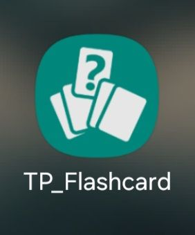
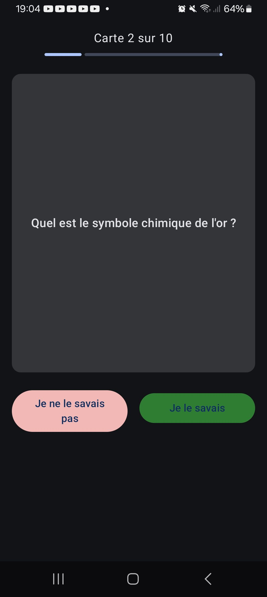
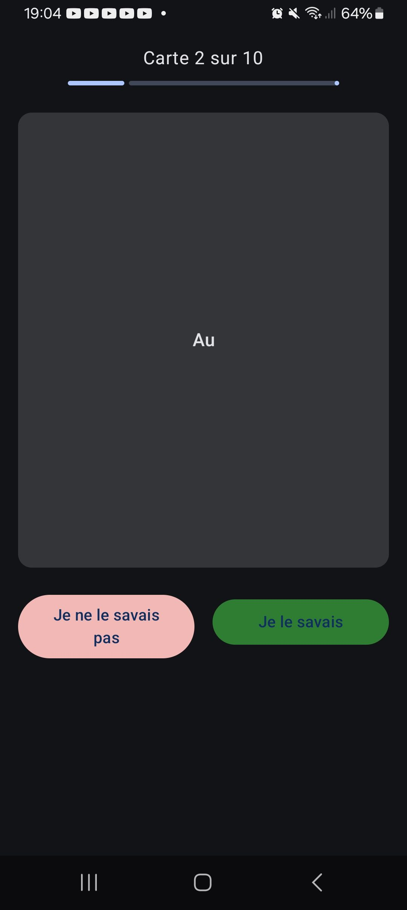

# Android-Tp-Flashcards

Réalisé par Mathys PIERREZ

## Description
Cette application Android développée en Kotlin avec Jetpack Compose a été réalisée dans le cadre du TP noté de fin d’année pour le cours de Programmation mobile au CNAM.

Elle propose aux utilisateurs de réviser des questions/réponses organisées par catégories, avec une interface réactive et animée. L’objectif pédagogique était de mettre en œuvre une architecture MVVM complète, d’utiliser les StateFlow, de gérer la navigation via NavHost et d’ajouter des animations pour enrichir l’expérience utilisateur.

## Fonctionnalités

Toutes les fonctionnalités sont implémentées en utilisant Jetpack Compose et suivent l'architecture MVVM.

## Captures d’écran

### Logo 



### Écrans de l'application

<p>
    
    
    
</p>

### Fin de la session de révision


## Installation
- Cloner le projet avec la commande suivante :

```bash
git clone https://github.com/mpierrez/Android-Tp-Flashcards
```

- Ouvrir avec Android Studio

- Exécuter sur un émulateur ou un appareil physique Android.
